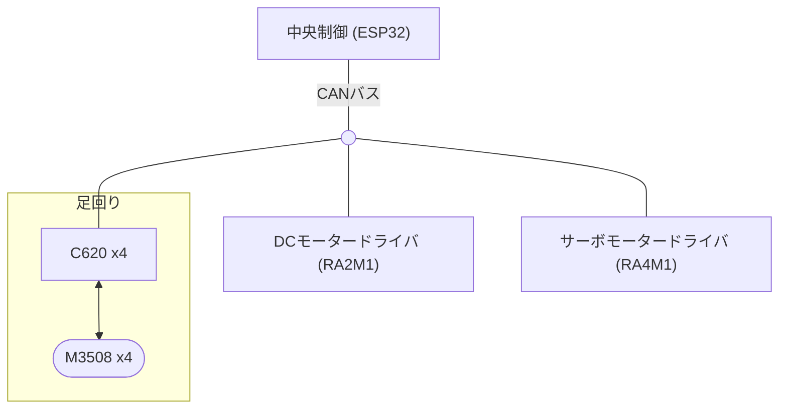
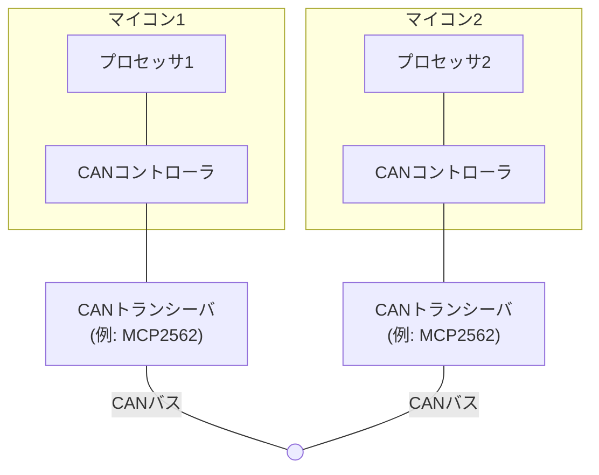
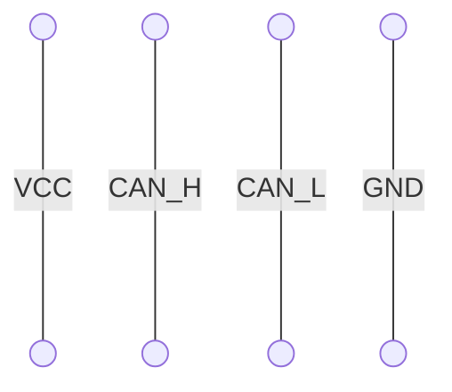

# Can you use CAN?

CAN通信の極意  
~DRCで使われるCAN通信技術の紹介~

<!--

-->
---
layout: presenter
presenterImage: https://avatars.githubusercontent.com/u/62449493
twitter: '@kotek__D'
twitterUrl: https://x.com/kotek__D
---

# kotek (鈴木倖人)

<p>
DRCで制御をやってる人です
</p>

- 同志社大学 理工学部 電子工学科 B2
- DRC 制御班
- web が好き
- プログラミングサークル Do'er 運営
- <a href="https://x.com/kotek__D" flex items-center w-fit><logos-twitter mr-1 />@kotek__D</a>
<!--

-->
---

# DRCでのCAN通信の活躍

## 春ロボ2025



<!--
-->

---

# なぜCANなのか？

- **ノイズ耐性**  
  差動信号で長距離伝送が可能。モータの周りに巻きつけても平気

- **多ノード接続**  
  1本のバスに最大2032ノード接続可能。配線は適当につなぐだけ

- **優先順位制御**  
  重要なメッセージを優先送信。リアルタイム制御に最適

- **エラーチェック**  
  CRCによる高信頼性通信。誤り検出と再送制御で安心

<!--
-->

--- 

# 目次

- CANの基礎知識
- 実際の運用プラクティス
- ソフトウェア実装例
- トラブルシューティング


---
layout: center
---

# <div text-7xl text-center mx-auto>CANの基礎知識</div>


---

# バス型通信方式


---

# 差動通信 

耐ノイズ性に優れた物理層


<!--
-->

---

# IDでメッセージを識別

### 送信側
各メッセージにIDを付与して送信 (0x000 ~ 0x7FF の2048種類)

### 受信側
目的のIDのメッセージだけを <span font-bold>フィルタ</span> して受信

--- 
layout: two-cols
---
# CANの物理層

<div class="bg-white/80 text-black px-4 py-2 rounded-lg">

#### 構成要素

- **CANコントローラ**  
CAN通信のプロトコル処理を行う専用IC  
ESP32、RA4M1、STM32F303 などに内蔵されている
- **CANトランシーバ**  
CAN信号を物理層に変換するデバイス  
MCP2562 や TJA1050 など

</div>

::right::




---
layout: center
---

# <div text-7xl text-center mx-auto>実際の運用</div>


---

# 4線式CANケーブル


### **CAN2線 + 電源線2本**  

CANの2線に制御用電源線を追加した4線式ケーブルを使用

<div class="flex mt-8">
<div class="w-1/2">

#### ケーブル




</div>
<div class="w-1/2">

#### 端子 (JST GH 4ピンコネクタ)


</div>
</div>

---


# CAN ID割当表 (関西春ロボ2025)

Figmaで共同編集しました


<div class="overflow-x-auto overflow-y-auto max-h-96 text-black bg-white/70 rounded-lg p-4 text-sm">

|**モジュール**     |**CAN ID**|
|----------|------|
|中央基盤      |0x000 |
|DCモータ制御基板0|0x100 |
|DCモータ制御基板1|0x101 |
|DCモータ制御基板2|0x102 |
|電力基盤0     |0x400 |
|電力基盤1     |0x401 |
|サーボ基盤(コーン)|0x300 |
|サーボ基盤(ボール)|0x301 |
|(M3508モータ)|0x20n |

</div>

---

# CANメッセージフォーマット (関西春ロボ2025)

Figmaで共同編集しました  

8バイト固定長メッセージ

<div class="overflow-x-auto overflow-y-auto max-h-96 text-black bg-white/70 rounded-lg p-4 text-sm">

|0     |1                         |2      |3                                           |4                            |5        |6        |7        |
|-----|-------------------------|-------|--------------------------------------------|-----------------------------|---------|---------|---------|
|命令ID   |データ<br>(数値)<br>(最上位バイト)          |データ<br>(数値)|データ<br>(数値)                                     |データ<br>(数値)<br>(最下位バイト)              |データ(おまけ)0|データ(おまけ)1|データ(おまけ)2|

</div>

---

# CAN ID割当表 (関西春ロボ2025)
Figmaで共同編集しました

<div class="overflow-x-auto overflow-y-auto max-h-96 text-black bg-white/70 rounded-lg p-4 text-sm">

|**CANメッセージID**|**機能**                       |**命令**  |**データ(数値)<br>(signed or unsigned long)**           |**データ(おまけ)(3byte)**              |
|-----------|-------------------------|----|--------------------------------------------|-----------------------------|
|0x000      |中央基盤にバッテリー電圧を送信<br>(from 基盤0)|0x00|24Vバッテリーの電圧[V]<br>（unsigned）                    |過放電警告<br>（0バイト目を1）<br> 過電圧警告<br>（2バイト目を1）|
|0x000      |中央基盤にバッテリー電圧を送信<br>(from 基盤1)|0x01|12Vバッテリーの電圧[V]<br>（unsigned）                    |過放電警告<br>（0バイト目を1）<br> 過電圧警告<br>（2バイト目を1）|
|0x300      |ハンド0を閉じる                 |0x00|-                                          |-                           |
|0x300      |ハンド0を開く                  |0x01|-                                          |-                           |
|0x300      |ハンド1を閉じる                 |0x10|-                                          |-                           |
|0x300      |ハンド1を開く                  |0x11|-                                          |-                           |
|0x300      |光れ！                      |0x20|-                                          |-                           |
|0x301      |ボールを取る                   |0x00|-                                          |-                           |
|0x301      |ボールを離す                   |0x01|-                                          |-                           |
|0x301      |ボールを投げて， 元の位置に戻す         |0x02|-                                          |-                           |
|0x100      |コーン用ハンド0を上昇させる           |0x00|-                                          |-                           |
|0x100      |コーン用ハンド0を下降させる           |0x01|-                                          |-                           |
|0x100      |コーン用ハンド0を停止させる           |0x02|-                                          |-                           |
|0x101      |コーン用ハンド1を上昇させる           |0x00|-                                          |-                           |
|0x101      |コーン用ハンド1を下降させる           |0x01|-                                          |-                           |
|0x101      |コーン用ハンド1を停止させる           |0x02|-                                          |-                           |
|0x102      |ボール用ハンドを上昇させる            |0x00|-                                          |-                           |
|0x102      |ボール用ハンドを下降させる            |0x01|-                                          |-                           |
|0x102      |ボール用ハンドを停止させる            |0x02|-                                          |-                           |
|0x400      |各足回りモーターへの電力供給の管理        |0x00|4bitをMOSFETのONOFFに対応<br>(例)全MOSFETオン 0x01010101|-                           |
|0x401      |各ハンドへの電力供給の管理            |0x00|4bitをMOSFETのONOFFに対応<br>(例)全MOSFETオン 0x01010101|-                           |

</div>

---

# 各種設定

- **CAN規格**  
   - CAN2.0A (11ビットID)
- **通信速度** 
   - 1Mbps
- **終端抵抗**
   - バス両端に120Ωを設置

---

# ソフトウェア
- **RA4M1**  
   - フレームワーク: Arduino
   - ライブラリ: <a href="https://github.com/akizukid/Arduino_CAN">Arduino_CAN</a>
   - 開発環境: Arduino IDE, VSCode + PlatformIO

- **ESP32**
   - フレームワーク: Arduino
   - ライブラリ: <a href="https://docs.espressif.com/projects/esp-idf/en/stable/esp32/api-reference/peripherals/twai.html">twai.h</a>
   - 開発環境: VSCode + PlatformIO

---
layout: center
---

# RA4M1での実際のCAN受信コード

```cpp {class="w-full"}
bool read_can_data(uint32_t *out_command, int32_t *out_value, uint32_t *out_omake) {
    CanMsg const msg = CAN.read();
    int id = msg.id; // IDを取得
    int length = msg.data_length;

    if (id != CAN_ID || length != 8) {
        return false;
    }

    uint32_t command = msg.data[0];
    uint32_t value = static_cast<uint32_t>(msg.data[1]) << 24 | static_cast<uint32_t>(msg.data[2]) << 16 |
                     static_cast<uint32_t>(msg.data[3]) << 8 | static_cast<uint32_t>(msg.data[4]);
    uint32_t omake = static_cast<uint32_t>(msg.data[5]) << 16 | static_cast<uint32_t>(msg.data[6]) << 8 |
                     static_cast<uint32_t>(msg.data[7]);

    int32_t bit_casted_value = 0;
    memcpy(&bit_casted_value, &value, sizeof(value));

    *out_command = command;
    *out_value = bit_casted_value;
    *out_omake = omake;

    return true;
}
```

---
layout: center
---

# ESP32での実際のCAN送信コード (関数内部)

<div class="h-100 overflow-y-scroll">

```cpp [main.cpp] {class="w-full"}
void CanCommunicator::transmit(const CanTxMessage message) const {
        static uint32_t count = 0;

        // CANメッセージ構築
        twai_message_t tx_message;
        tx_message.identifier = message.id;
        tx_message.extd = 0;
        tx_message.rtr = 0;
        tx_message.ss = 0;
        tx_message.self = 0;
        tx_message.dlc_non_comp = 0;
        tx_message.data_length_code = 8;
        for (uint8_t i = 0; i < 8; i++) {
            tx_message.data[i] = message.data[i];
        }

        // CANメッセージ送信
        const auto tx_result = twai_transmit_v2(twai_handle, &tx_message, 0);

        // デバッグ用出力
        if (count % DEBUG_PRINT_INTERVAL == 0) {
            #ifdef CAN_DEBUG
            if (tx_result == ESP_ERR_TIMEOUT) {
                Serial.println("Transmit Fail: ESP_ERR_TIMEOUT");
                return;
            }
            if (tx_result == ESP_ERR_INVALID_ARG) {
                Serial.println("Transmit Fail: ESP_ERR_INVALID_ARG");
                return;
            }
            if (tx_result == ESP_ERR_INVALID_STATE) {
                Serial.println("Transmit Fail: ESP_ERR_INVALID_STATE");
                return;
            }
            if (tx_result == ESP_FAIL) {
                Serial.println("Transmit Fail: ESP_FAIL");
                return;
            }
            if (tx_result == ESP_ERR_NOT_SUPPORTED) {
                Serial.println("Transmit Fail: ESP_ERR_NOT_SUPPORTED");
                return;
            }
            if (tx_result != ESP_OK) {
                Serial.println("Transmit Fail: Unexpected error: " + String(tx_result));
                return;
            }
            #endif
        }
    }
```

</div>

---
layout: center
---

# ESP32での実際のCAN送信コード (関数利用側)

<div class="h-100 overflow-y-scroll">

```cpp {class="w-full"}
// Rスティック上でハンド上昇
    if (ps5.RStickY() > 10) {
        can_communicator->transmit(
            can::CanTxMessageBuilder()
                .set_dest(can::CanDest::svmd)
                .set_value(static_cast<uint32_t>(1.0f * std::numeric_limits<uint32_t>::max() / 270))
                .build());
        Serial.println("Hand up command sent");
    }
```

</div>

---

# CAN通信が動かないときのチェックリスト

<div v-click>

### 配線はつながっていますか？ (∞敗)
  - CANのケーブルがそもそもつながっていない orz
  - 基盤に電源がはいっていない orz

</div>

<div v-click class="mt-4">

### 通信速度は一致していますか？ (∞敗)
  - 送信側と受信側で通信速度が異なると通信できません

</div>

<div v-click class="mt-4">

### 終端抵抗は設置されていますか？ (多数敗)
  - バス両端に120Ωの抵抗が必要 

</div>


<div v-click class="mt-4">

### フィルタ設定はあっていますか？ (多数敗)
  - 受信側でフィルタ設定をしている場合、目的のIDが通るように設定されているか確認

</div>


---

# CAN通信が動かないときのチェックリスト (続き)

<div v-click class="mt-4">

### IDの範囲はあっていますか？ (1敗)
  - CAN2.0Aでは11ビットID (0x000 ~ 0x7FF) しか使えない！
  - 0x800 などのIDは使えません

</div>

<div v-click class="mt-4">

### 実装されているICはあっていますか？ (1敗)
  - CANトランシーバがつく場所にI/Oエクスパンダーがついていた (！？)
  - ICの型番を確認しましょう

</div>


--- 

#  まとめ

- CAN通信はノイズ耐性と多ノード接続に優れた通信方式
- 一度動けば非常に安定して動作する
- 質問があればどうぞ！

--- 
layout: center
---

<div text-7xl font-bold text-center>ご清聴ありがとうございました！</div>